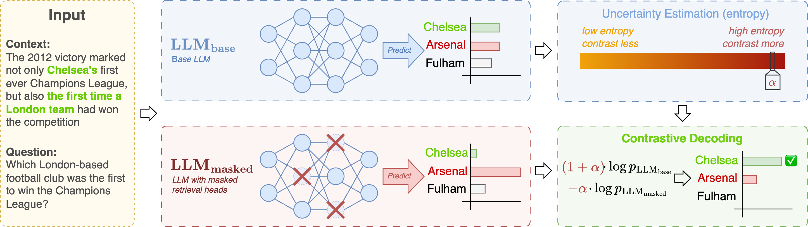

# DeCoRe: Decoding by Contrasting Retrieval Heads to Mitigate Hallucination



**Paper:** [https://arxiv.org/abs/2410.18860](https://arxiv.org/abs/2410.18860)

**Authors:** [Aryo Pradipta Gema](https://aryopg.github.io)$^{Q,K}$, [Chen Jin](https://chenjin.netlify.app/)$^{K}$, [Ahmed Abdulaal](https://uk.linkedin.com/in/ahmed-abdulaal-5b8b6a295)$^{K,V}$, [Tom Diethe](https://tomdiethe.com/)$^{K}$, [Philip Teare](https://uk.linkedin.com/in/philteare)$^{K}$, [Beatrice Alex](https://www.ed.ac.uk/profile/dr-beatrice-alex)$^{Q}$, [Pasquale Minervini](http://www.neuralnoise.com/)$^{Q}$, [Amrutha Saseendran](https://uk.linkedin.com/in/amrutha-saseendran)$^{K}$

$^{Q}$ University of Edinburgh, United Kingdom

$^{K}$ Centre for AI, Data Science \& Artificial Intelligence, R\&D, AstraZeneca, United Kingdom

$^{V}$ University College London, United Kingdom

## 🛠️ Setup

### 🌏 Environment variable

Setup an `.env` file in the root folder

```bash
nano .env
```

```
HF_TOKEN=<your_huggingface_write_access_token>
```

### 📦 Required Packages

#### 🐍 conda
```bash
conda env create -f environment.yaml
conda activate decore
```

#### 🐍 pip
```bash
pip install -r requirements.txt
```

For development, we use `black` and `isort`. If you wish to proceed without them and if you are using VSCode, update `.vscode/settings.json` accordingly.

### 🍄 Retrieval Heads

The retrieval heads for the models can be found in the [`retrieval_heads`](retrieval_heads/) folder.

To reproduce these (or if you just want to experiment with newer models or try this step yourself), visit the [Retrieval_Head](https://github.com/nightdessert/Retrieval_Head) repository to detect the retrieval heads for each model. For instance:

```bash
# Llama3-8B-Instruct
python retrieval_head_detection.py  --model_path meta-llama/Meta-Llama-3-8B-Instruct --s 0 --e 5000

# Llama3-70B-Instruct
python retrieval_head_detection.py  --model_path meta-llama/Meta-Llama-3-70B-Instruct --s 0 --e 5000

# Mistral-7B-v0.3-Instruct
python retrieval_head_detection.py  --model_path mistralai/Mistral-7B-Instruct-v0.3 --s 0 --e 5000

# Qwen2-7B-Instruct
python retrieval_head_detection.py  --model_path Qwen/Qwen2-7B-Instruct --s 0 --e 5000
```

> 💡 **TIP:**  If you fail to do the retrieval head detection for Qwen2 in a multi-gpu setup, try using only 1 GPU (e.g., `CUDA_VISIBLE_DEVICES=0`).

### 🪄 To WandB or not to WandB

If you wish to use WandB, please update the `configs/config.yaml`, specifically the values of `wandb_project` and `wandb_entity`.
We generally recommend using WandB, but if you prefer not to, you can still run the script using the `debug` flag or by setting the value of `debug` in `configs/config.yaml` into `true`. This will bypass the wandb initialisation and logging.

## 🌲 Directory Structure

```
.
├── README.md
├── environment.yaml
├── requirements.txt
├── .env.example                     # Example environment file
├── .env                             # Your environment file
├── configs/                         # Hydra configs
│   ├── config.yaml                  # Default config values that will be replaced by experiment config
│   ├── data/                        # Directory containing dataset config files, that will be used in the experiment config files
│   ├── data_loader/                 # Directory containing one default data loader config file
│   ├── decoder/                     # Directory containing decoder config files (e.g., DeCoRe, Baseline, DoLa, ITI), that will be used in the experiment config files
│   ├── experiment/                  # Directory containing experiment config files per decoder
│   └── model/                       # Directory containing model config files, that will be used in the experiment config files
├── data/                            # Directory containing dataset files
├── docs/                            # Directory containing assets for documentation
├── notebooks/                       # Jupyter notebooks directory, only for creating plots
├── retrieval_heads/                 # Directory containing pre-computed retrieval heads
├── scripts/
│   ├── main.py                      # The main script for evaluating the runs
└── src/
    ├── __init__.py
    ├── configs.py                   # Handle Hydra configs
    ├── datasets/                    # Dataset classes
    ├── factories.py                 # Factory functions to help with instantiating dataset, model, and metric classes. Called in the run.py
    ├── metrics/                     # Metrics classes (the name must match the dataset classes)
    ├── models/                      # Model classes, instantiating the selected models and decoder method
    ├── run.py                       # The run manager, handling the selection of dataset, model, and metric classes, initializing WandB, etc.
    └── utils/
        ├── __init__.py
        ├── common_utils.py          # Common utility functions
        ├── modelling_llama.py       # Minimally modified from the Retrieval head repository
        ├── modelling_mistral.py     # Minimally modified from the Retrieval head repository
        └── modelling_qwen2.py       # Minimally modified from the Retrieval head repository
```

## 📝 Evaluation

### General evaluation

The evaluation uses the `scripts/main.py` and a Hydra config file from the `configs/experiment` folder. For instance:

```bash
python scripts/main.py experiment=memotrap/decore_entropy/llama3_8b_instruct decoder.configs.num_retrieval_heads=100
```

Notice that the hydra configs are structured based on `dataset_name > decoder_name > model_name.yaml`. It is then followed with custom hyperparameters (e.g., `decoder.configs.num_retrieval_heads`).

Some dataset can be further modified depending on the variation that you want to evaluate the model against. The options are:

- `NQ`: `closed_book`, `oracle`
- `MuSiQue`: `direct_closed_book`, `direct_open_book`, `cot_closed_book`, `cot_open_book`

Therefore, to run `NQ` with `closed_book` setting, you can simply do:

```bash
python scripts/main.py experiment=nq/decore_entropy/llama3_8b_instruct decoder.configs.num_retrieval_heads=10 data.variation=closed_book
```

Please check examples of how to design the bash commands in [`evaluation_bash_commands_example.md`](evaluation_bash_commands_example.md) which contain the examples on how to run evaluations of $\text{DeCoRe}_{\text{entropy}}$ with Llama3-8B-Instruct on multiple datasets.

### TruthfulQA Gen Evaluation

Add OpenAI API key to your `.env` file:
```
OPENAI_API_KEY=<your_openai_api_key>
```

Fine tune `davinci-002` using the data that can be found in [`data/TruthfulQA_eval_fine_tune`](data/TruthfulQA_eval_fine_tune)

Set the fine-tuned model id to the `.env` file

```
GPT_JUDGE_NAME=<your_gpt_judge_fine_tuned_model_id>
GPT_INFO_NAME=<your_gpt_info_fine_tuned_model_id>
```

The ids of both fine-tuned models would usually be prefixed by `ft:davinci-002:...`.

Download the predictions from WandB (if you follow this codebase, it will be in a json format). Amd pass it on to the evaluation script.

```
# Evaluate!

python src/metrics/truthfulqa_gen.py --pred_filepath=path/to/truthfulqa_model_prediction.json
```

## 🙏 Citation

```
@article{gema2024decore,
      title={DeCoRe: Decoding by Contrasting Retrieval Heads to Mitigate Hallucinations}, 
      author={Aryo Pradipta Gema and Chen Jin and Ahmed Abdulaal and Tom Diethe and Philip Teare and Beatrice Alex and Pasquale Minervini and Amrutha Saseendran},
      year={2024},
      eprint={2410.18860},
      archivePrefix={arXiv},
      primaryClass={cs.CL},
      url={https://arxiv.org/abs/2410.18860}, 
}
```
