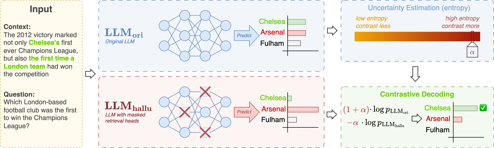

# DeCoRe: Decoding by Contrasting Retrieval Heads to Mitigate Hallucination




## Metadata
- Paper draft: https://www.overleaf.com/6919357326kssvrkxzmbyz#212775

## Setup

### Environment variable

Setup an `.env` file in the root folder

```bash
nano .env
```

```
HF_TOKEN=<your_huggingface_write_access_token>
```

### Required Packages

```bash
pip install -r requirements.txt
```

### Retrieval Heads

The retrieval heads for the models can be found in the [`retriever_heads`](retriever_heads/) folder

To reproduce these, you may go to the [Retrieval_Head](https://github.com/nightdessert/Retrieval_Head) repository to detect the retrieval heads for each model.

```bash
# Llama3-8B
python retrieval_head_detection.py  --model_path meta-llama/Meta-Llama-3-8B --s 0 --e 5000
# Llama3-8B-Instruct
python retrieval_head_detection.py  --model_path meta-llama/Meta-Llama-3-8B-Instruct --s 0 --e 5000

# Llama3-70B
python retrieval_head_detection.py  --model_path meta-llama/Meta-Llama-3-70B --s 0 --e 5000
# Llama3-70B-Instruct
python retrieval_head_detection.py  --model_path meta-llama/Meta-Llama-3-70B-Instruct --s 0 --e 5000

# Mistral-7B-v0.3
python retrieval_head_detection.py  --model_path mistralai/Mistral-7B-v0.3 --s 0 --e 5000
# Mistral-7B-v0.3-Instruct
python retrieval_head_detection.py  --model_path mistralai/Mistral-7B-Instruct-v0.3 --s 0 --e 5000

# Phi-3-mini-4k-instruct
CUDA_VISIBLE_DEVICES=0 python retrieval_head_detection.py  --model_path microsoft/Phi-3-mini-4k-instruct --s 0 --e 5000

# Phi-3-medium-4k-instruct
CUDA_VISIBLE_DEVICES=0 python retrieval_head_detection.py  --model_path microsoft/Phi-3-medium-4k-instruct --s 0 --e 5000

# Qwen2-7B-Instruct
CUDA_VISIBLE_DEVICES=0 python retrieval_head_detection.py  --model_path Qwen/Qwen2-7B-Instruct --s 0 --e 5000
```

## Evaluation

### TruthfulQA Gen Evaluation

Add OpenAI API key to your `.env` file:
```
OPENAI_API_KEY=<your_openai_api_key >
```

Fine tune `davinci-002` using the data that can be found in [`data/TruthfulQA_eval_fine_tune`](data/TruthfulQA_eval_fine_tune)

Set the fine-tuned model id to the `.env` file

```
GPT_JUDGE_NAME=<your_gpt_judge_fine_tuned_model_id>
GPT_INFO_NAME=<your_gpt_info_fine_tuned_model_id>
```

The ids of both fine-tuned models would usually be prefixed by `ft:davinci-002:...`.

Download the predictions from WandB (if you follow my codebase, it will be in a json format). Amd pass it on to the evaluation script.

```
# Evaluate!

python src/metrics/truthfulqa_gen.py --pred_filepath=path/to/truthfulqa_model_prediction.json
```